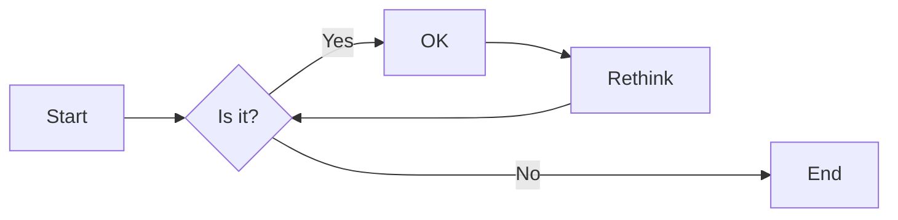
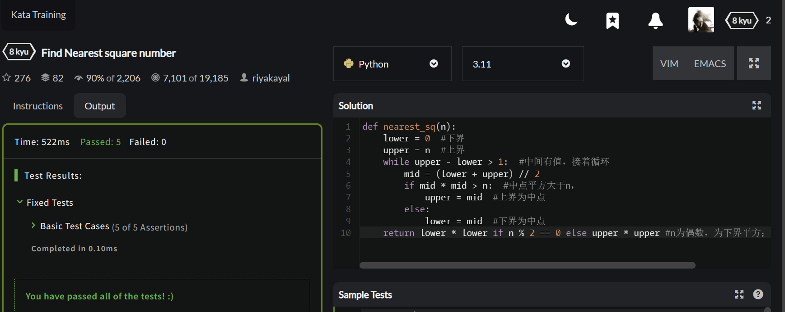
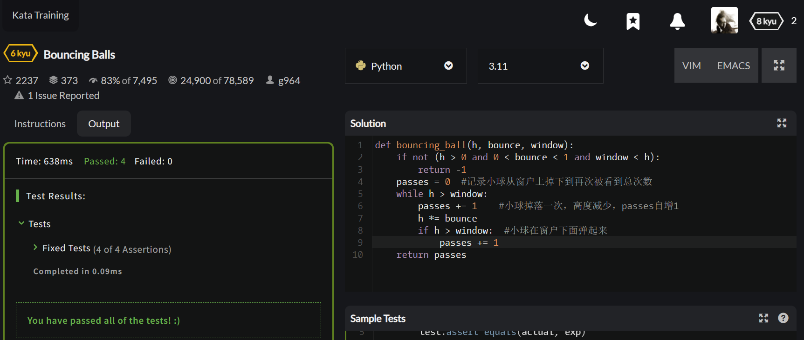
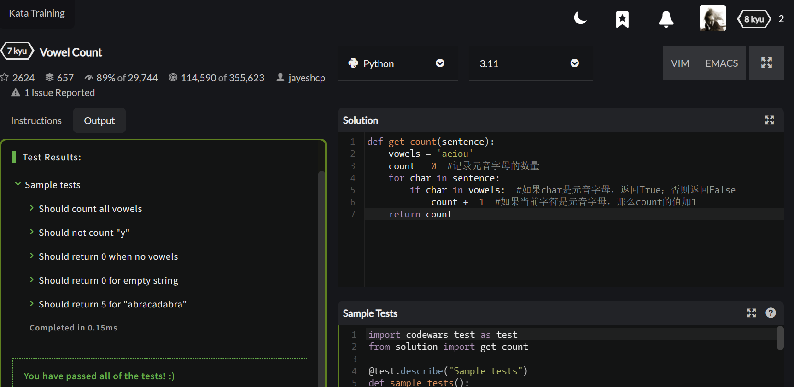
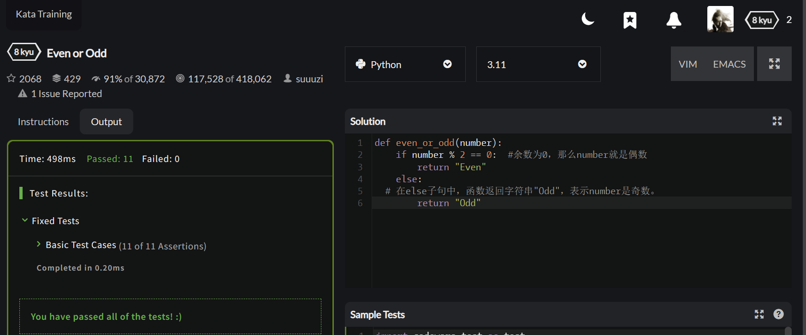
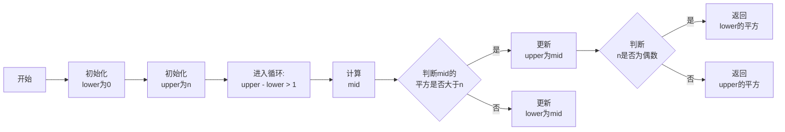
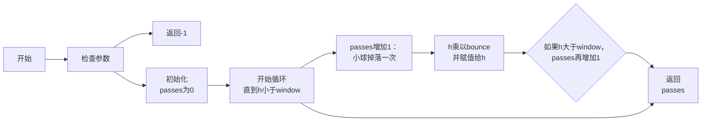
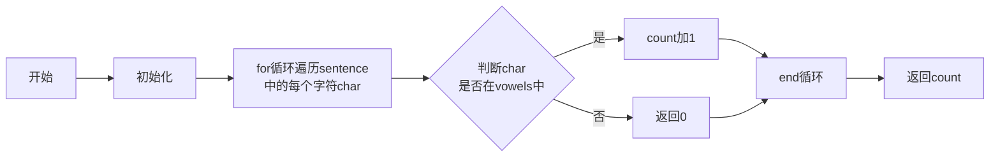
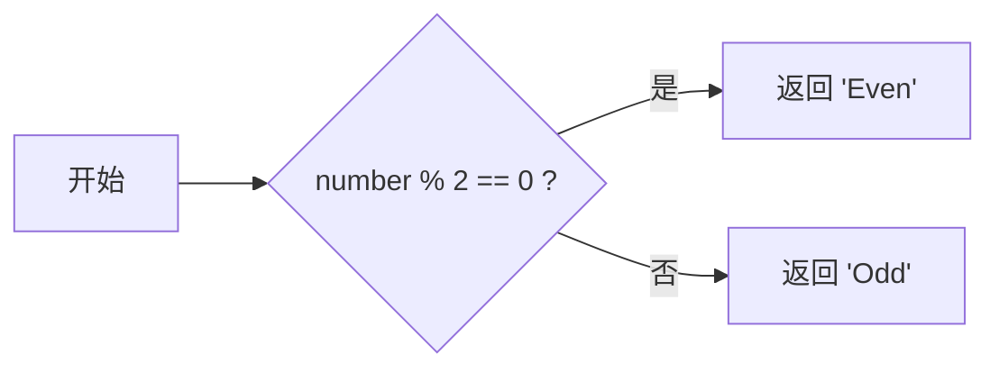

# 实验二 Python变量、简单数据类型

班级： 21计科2班

学号： B20210302232

姓名： 闫新宇

Github地址：<https://github.com/yanxinyvvv/sytwo.git>

CodeWars地址：<https://www.codewars.com/users/闫新宇>

---

## 实验目的

1. 使用VSCode编写和运行Python程序
2. 学习Python变量和简单数据类型

## 实验环境

1. Git
2. Python 3.10
3. VSCode
4. VSCode插件

## 实验内容和步骤

### 第一部分

实验环境的安装

1. 安装Python，从Python官网下载Python 3.10安装包，下载后直接点击可以安装：[Python官网地址](https://www.python.org/downloads/)
2. 为了在VSCode集成环境下编写和运行Python程序，安装下列VScode插件
   - Python
   - Python Environment Manager
   - Python Indent
   - Python Extended
   - Python Docstring Generator
   - Jupyter
   - indent-rainbow
   - Jinja

---

### 第二部分

Python变量、简单数据类型和列表简介

完成教材《Python编程从入门到实践》下列章节的练习：

- 第2章 变量和简单数据类型

---

### 第三部分

在[Codewars网站](https://www.codewars.com)注册账号，完成下列Kata挑战：

---

#### 第1题：求离整数n最近的平方数（Find Nearest square number）

难度：8kyu

你的任务是找到一个正整数n的最近的平方数
例如，如果n=111，那么nearest_sq(n)（nearestSq(n)）等于121，因为111比100（10的平方）更接近121（11的平方）。
如果n已经是完全平方（例如n=144，n=81，等等），你需要直接返回n。
代码提交地址
<https://www.codewars.com/kata/5a805d8cafa10f8b930005ba>

---

#### 第2题：弹跳的球（Bouncing Balls）

难度：6kyu

一个孩子在一栋高楼的第N层玩球。这层楼离地面的高度h是已知的。他把球从窗口扔出去。球弹了起来,  例如:弹到其高度的三分之二（弹力为0.66）。他的母亲从离地面w米的窗户向外看,母亲会看到球在她的窗前经过多少次（包括球下落和反弹的时候）？

一个有效的实验必须满足三个条件：

- 参数 "h"（米）必须大于0
- 参数 "bounce "必须大于0且小于1
- 参数 “window "必须小于h。

如果以上三个条件都满足，返回一个正整数，否则返回-1。
**注意:只有当反弹球的高度严格大于窗口参数时，才能看到球。**
代码提交地址
<https://www.codewars.com/kata/5544c7a5cb454edb3c000047/train/python>

---

#### 第3题： 元音统计(Vowel Count)

难度： 7kyu

返回给定字符串中元音的数量（计数）。对于这个Kata，我们将考虑a、e、i、o、u作为元音（但不包括y）。输入的字符串将只由小写字母和/或空格组成。

代码提交地址：
<https://www.codewars.com/kata/54ff3102c1bad923760001f3>

---

#### 第4题：偶数或者奇数（Even or Odd）

难度：8kyu

创建一个函数接收一个整数作为参数，当整数为偶数时返回”Even”当整数位奇数时返回”Odd”。
代码提交地址：
<https://www.codewars.com/kata/53da3dbb4a5168369a0000fe>

### 第四部分

使用Mermaid绘制程序流程图

安装Mermaid的VSCode插件：

- Markdown Preview Mermaid Support
- Mermaid Markdown Syntax Highlighting

使用Markdown语法绘制你的程序绘制程序流程图（至少一个），Markdown代码如下：


显示效果如下：



查看Mermaid流程图语法-->[点击这里](https://mermaid.js.org/syntax/flowchart.html)

使用Markdown编辑器（例如VScode）编写本次实验的实验报告，包括[实验过程与结果](#实验过程与结果)、[实验考查](#实验考查)和[实验总结](#实验总结)，并将其导出为 **PDF格式** 来提交。

## 实验过程与结果

### 第二部分 Python变量、简单数据类型和列表简介

**练习2.1：** 简单消息：将一条消息赋给变量，并将其打印出来。
```python
message="Hello World"
print(message)
```

**练习2.2：** 多条简单消息：将一条消息赋给变量，并将其打印出来；再将变量的值修改为一条新消息，并将其打印出来。
```python
message = "Hello World"
print(message)
message = "Hello World!"
print(message)
```

**练习2.3：** 个性化消息：用变量表示一个人的名字，并向其显示一条消息。显示的消息应非常简单，如下所示：Hello Eric, would you like to learn some Python today?
```python
name = "Eric"
print("Hello "+name+",would you like to learn some Python today?")
```

**练习2.4：** 调整名字的大小写：用变量表示一个人的名字，再分别以全小写、全大写和首字母大写的方式显示这个人名。
```python
name = "Eric"
print(name+"\n"+name.title()+"\n"+name.upper()+"\n"+name.lower())
```

**练习2.5：** 名言1：找到你钦佩的名人说的一句名言，将这个名人的姓名和名言打印出来。输出应类似于下面这样(包括引号)：Albert Einstein once said, "A person who never made a mistake never tried anything new.”
```python
print('Albert Einstein once said,"A person who never made a mistake never tried angthing new"')
```

**练习2.6：** 名言2：重复练习2.5，但用变量famous_person表示名人的姓名，再创建要显示的消息并将其赋给变量message，然后打印这条消息。
```python
famous_person = "Albert Einstein"
message = '"A person who never made a mistake never tried angthing new"'
print(famous_person+" once said,"+message)
```

**练习2.7：** 删除人名中的空白：用变量表示一个人的名字，并在其开头和末尾都包含一些空白字符。务必至少使用字符组合“\t”和“\n”各一次。
```python
person = "\tEric\t"
print(person+person.rstrip()+person.lstrip()+person.strip())
num=312
```

**练习2.8：** 文件扩展名：Python提供了removesuffix()方法，其工作原理与remove-prefix()很像。请将值'python_notes.txt'赋给变量filename，再使用removesuffix()方法来显示不包含扩展名的文件名，就像文件浏览器所做的那样。
```python
filename = "python_notes.txt"  
filename_no_ext = filename.removesuffix(".txt")  
print(filename_no_ext)
```

**练习2.9：** 数字8：编写4个表达式，分别使用加法、减法、乘法和除法运算，但结果都是数字8。为了使用函数调用print()来显示结果，务必将这些表达式用括号括起来。也就是说，你应该编写4行类似于这样的代码:print(5+3),输出应为4行，其中每行都只包含数字8。
```python
print(5+3)
print(9-1)
print(2*4)
print(24/3)
```

**练习2.10：** 最喜欢的数：用一个变量来表示你最喜欢的数，再使用这个变量创建一条消息，指出你最喜欢的数是什么，然后将这条消息打印出来。
```python
number = 8
print("I like "+str(number))
```

**练习2.11：** 添加注释：选择你编写的两个程序，在每个程序中至少添加一条注释。如果程序太简单，实在没有什么需要说明的，就在程序文件开头加上你的姓名和当前日期，再用一句话阐述程序的功能。
```python
# 输出一条消息"Hello World"
message="Hello World"
print(message)
```

**练习2.12：** Python之禅：在Python终端会话中执行命令import this，并粗略地浏览一下其他指导原则。
```python
import this
```

### 第三部分 Codewars Kata挑战

**第1题：求离整数n最近的平方数（Find Nearest square number）**
```python
def nearest_sq(n):  
    lower = 0  #下界
    upper = n  #上界
    while upper - lower > 1:  #中间有值，接着循环
        mid = (lower + upper) // 2  
        if mid * mid > n:  #中点平方大于n，
            upper = mid  #上界为中点
        else:  
            lower = mid  #下界为中点
    return lower * lower if n % 2 == 0 else upper * upper #n为偶数，为下界平方；n为奇数，为下界平方
```
**运行结果**

https://img-blog.csdnimg.cn/66f38dcb08264669b313b6da16db625b.png

**第2题：弹跳的球（Bouncing Balls）**
```python
def bouncing_ball(h, bounce, window):  
    if not (h > 0 and 0 < bounce < 1 and window < h):  
        return -1  
    passes = 0  #记录小球从窗户上掉下到再次被看到总次数
    while h > window:  
        passes += 1    #小球掉落一次，高度减少，passes自增1
        h *= bounce    
        if h > window:  #小球在窗户下面弹起来
            passes += 1    
    return passes
```
**运行结果**

https://img-blog.csdnimg.cn/82a671bb51de483bb105a9602c1946e6.png

**第3题：元音统计(Vowel Count)**
```python
def get_count(sentence):  
    vowels = 'aeiou'  
    count = 0  #记录元音字母的数量
    for char in sentence:  
        if char in vowels:  #如果char是元音字母，返回True；否则返回False
            count += 1  #如果当前字符是元音字母，那么count的值加1
    return count
```
**运行结果**

https://img-blog.csdnimg.cn/70d7c9d3042c451caf3856ce07c3a149.png

**第4题：偶数或者奇数（Even or Odd）**
```python
def even_or_odd(number):  
    if number % 2 == 0:  #余数为0，那么number就是偶数
        return "Even"  
    else:  
  # 在else子句中，函数返回字符串"Odd"，表示number是奇数。  
        return "Odd"
```
**运行结果**

https://img-blog.csdnimg.cn/5491f88f198846a0acfac3f615ede9e3.png

### 第四部分 使用Mermaid绘制程序流程图

**第1题：求离整数n最近的平方数（Find Nearest square number）**
```
flowchart LR 
  A[开始]  
  A --> B[初始化\nlower为0]  
  B --> C[初始化\nupper为n]  
  C --> D[进入循环:\n upper - lower > 1]  
  D --> E[计算\nmid]  
  E --> F{判断mid的\n平方是否大于n}  
  F -->|是| G[更新\nupper为mid]  
  F -->|否| H[更新\nlower为mid]  
  G --> I{判断\nn是否为偶数}  
  I -->|是| J[返回\nlower的平方]  
  I -->|否| K[返回\nupper的平方]
```



**第2题：弹跳的球（Bouncing Balls）**
```
flowchart LR  
    A[开始] --> B["检查参数"]  
    B --> C["返回-1"]  
    B --> D["初始化passes为0"]  
    D --> E["开始循环直到h小于window"]  
    E --> F["passes增加1：小球掉落一次"]  
    F --> G["h乘以bounce并赋值给h"]  
    G --> H{"如果h大于window，passes再增加1"}  
    H --> I["返回passes"]  
    E --> I
```



**第3题：元音统计(Vowel Count)**
```
flowchart LR  
    A[开始] --> B["检查参数"]  
    B --> C["返回-1"]  
    B --> D["初始化passes为0"]  
    D --> E["开始循环直到h小于window"]  
    E --> F["passes增加1：小球掉落一次"]  
    F --> G["h乘以bounce并赋值给h"]  
    G --> H{"如果h大于window，passes再增加1"}  
    H --> I["返回passes"]  
    E --> I
```



**第4题：偶数或者奇数（Even or Odd）**
```
flowchart LR  
    A[开始] --> B{number % 2 == 0 ?}  
    B -->|是| C["返回 'Even'"]  
    B -->|否| D["返回 'Odd'"]
```



## 实验考查

1. Python中的简单数据类型有那些？我们可以对这些数据类型做哪些操作？
Python中的简单数据类型：①整型;②浮点型;③复数;④布尔型;⑤字符串;⑥数字类型。
对这些数据类型做：①数值运算：包括加（+）、减（-）、乘（*）、除（/）、取模（%）、幂（**）等；②比较：可以比较这些数据类型的大小，结果为True或False（对于布尔型）；③赋值：可以将一个值赋给一个变量；④连接：对于字符串，可以使用"+"连接两个字符串；⑤搜索和替换：在字符串中，可以使用str.find(sub[, start[, end]])和str.replace(old, new[, count]])函数来查找和替换子字符串；⑥类型转换：可以将一种数据类型转换为另一种数据类型；⑦数学函数：对于数字类型，Python提供了各种数学函数如sqrt()、pow()、min()、max()等。

2. 为什么说Python中的变量都是标签？
在Python中，变量被用作对象的引用，这使得它们可以被视为对象的标签。当在Python中创建一个对象并将其赋值给一个变量时，这个变量就变成了指向该对象的标签。这意味着可以通过这个变量（标签）来访问和操作该对象。这种特性使得Python的变量具有很大的灵活性。如果想要改变一个对象的行为或属性，只需要改变对象本身，而不需要改变使用该对象的代码。这是因为变量只是一个指向对象的标签，而不是存储对象本身。因此，可以说Python中的变量都是标签，它们的作用是引用对象并使它们能够被访问和操作。

3. 有哪些方法可以提高Python代码的可读性？
提高Python代码的可读性：①适当的命名；②注释；③代码缩进；④使用空格和空行；⑤使用函数和类；⑥避免过长的代码行；⑦使用文档字符串⑧遵循编码规范。

## 实验总结

从Python变量、简单数据类型和列表简介以及Mermaid绘制程序流程图的学习和使用中，我学到很多关于Python编程的基础知识和技巧。Python作为一种动态类型语言，具有强大的灵活性和可塑性，可以轻松处理各种类型的数据。使用列表这种数据结构，可以有效地存储和操作一组相关的数据。同时，通过Mermaid流程图，可以更清晰地表达算法的逻辑，从而更好地理解程序的结构和功能。掌握了Python编程的基础知识，还了解了如何有效地组织和处理数据，以及如何使用流程图来提高代码的可读性和可维护性。在实验中遇到问题，也通过向老师和同学请教得以解决。